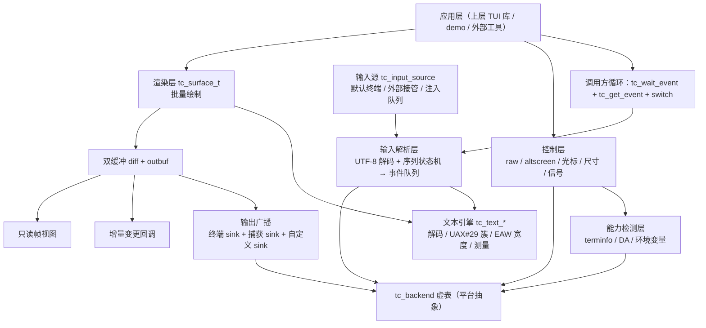

# 01 · 架构：分层、抽象与运行时模型

本文描述 TermCore 的内部架构：五层的职责边界、平台后端抽象、可插拔 I/O（输入源与输出 sink）、
数据流、生命周期状态机、线程与分配模型。公开 API 的细节在 `02` ~ `06` 中展开。

---

## 1. 架构总览



三条设计主线：

1. **文本引擎被输入与渲染共同复用**，二者对 Unicode 的解释绝对一致
2. **平台差异全部收敛在 `tc_backend` 之后**，上层只见字节流与尺寸
3. **输入与输出都可被外部替换或旁路**，这是离线测试与外部工具集成的基础

---

## 2. 五层职责与边界

| 层 | 职责 | 依赖 | 明确不做 |
| --- | --- | --- | --- |
| 控制层 | 终端状态进出、raw mode、altscreen、光标、尺寸、信号事件化、崩溃恢复 | 能力检测层、`tc_backend` | 不做布局、不管字体 |
| 能力检测层 | 探测并汇总能力位集，驱动降级 | `tc_backend`（DA 查询）、环境变量 | 不选择终端、不启动终端 |
| 输入解析层 | 字节流 → 结构化事件；注入与接管 | 文本引擎、能力位集 | 不分发事件（调用方拉取） |
| 文本引擎 | 解码、字符簇、宽度、测量排版 | 内置 UCD 表（或可选 ICU） | 不做 bidi / shaping |
| 输出渲染层 | surface 缓冲、绘制、diff、序列生成、广播、present | 文本引擎、能力位集、`tc_backend` | 不做组件与布局 |

层间规则：

- **只允许上层依赖下层**，不允许反向依赖（文本引擎不认识 term / surface）
- 跨层只传 POD 或不透明句柄，不传内部结构指针
- 能力位集是"只读配置快照"，进入后不再变动（尺寸变化会更新尺寸字段）

---

## 3. 头文件划分（公开 API）

| 头文件 | 内容 |
| --- | --- |
| `termcore/termcore.h` | 总入口：版本宏、状态、allocator、日志 sink |
| `termcore/types.h` | POD：`tc_cell` / `tc_color` / `tc_style` / `tc_rect` / `tc_change` / `tc_frame_view` |
| `termcore/term.h` | 控制层与事件：`tc_term_t`、`tc_term_options`、事件与拉取 API、sink、source |
| `termcore/surface.h` | `tc_surface_t` 与绘制 API、`tc_present` |
| `termcore/caps.h` | 能力位集与查询 |
| `termcore/text.h` | 文本引擎 `tc_text_*`（可独立包含，不依赖其它头） |
| `termcore/keycodes.h` | `TC_KEY_*` / `TC_MOD_*` 常量 |

> `termcore/text.h` 是唯一"零依赖"头：只依赖 `<stddef.h>` / `<stdint.h>` / `<stdbool.h>`，
> 上层布局框架可以只用它做文本测量。

---

## 4. 平台后端抽象：`tc_backend`

平台差异封装为一张虚表。`term` 持有一个后端实例；headless 模式使用 null 后端。

```c
typedef struct tc_backend_vtable {
    /* 生命周期 */
    tc_status (*init)(void* self, tc_allocator* alloc);
    void      (*dispose)(void* self);

    /* 控制 */
    tc_status (*set_raw)(void* self, bool on);
    tc_status (*enter_alt_screen)(void* self);
    tc_status (*leave_alt_screen)(void* self);
    tc_status (*set_cursor_visible)(void* self, bool visible);
    tc_status (*set_cursor_shape)(void* self, tc_cursor_shape shape);
    tc_status (*set_cursor_pos)(void* self, int x, int y);
    tc_status (*set_title)(void* self, const char* utf8);

    /* 尺寸 */
    tc_status (*get_size)(void* self, int* cols, int* rows);
    tc_status (*get_size_px)(void* self, int* w, int* h);

    /* I/O */
    tc_status (*wait_ready)(void* self, int timeout_ms, bool* ready);
    tc_status (*read)(void* self, void* buf, size_t cap, size_t* nread);
    tc_status (*write)(void* self, const void* buf, size_t len, size_t* nwritten);

    /* 能力查询（可超时，可不支持） */
    tc_status (*query_da)(void* self, int timeout_ms, tc_da_info* out);

    /* 信号 / 控制台事件 */
    tc_status (*install_signal_hooks)(void* self, tc_term_t* owner);
} tc_backend_vtable;
```

后端实现：

| 后端 | 场景 | 要点 |
| --- | --- | --- |
| `backend_posix` | Linux / macOS / BSD | `termios` 控制 raw、`ioctl(TIOCGWINSZ)` 取尺寸、`poll` 等待、`signal` 处理 SIGWINCH / SIGINT |
| `backend_null` | headless / CI / 单元测试 | 不触碰任何真实句柄；尺寸固定或由调用方设置；`read` 永不就绪；`write` 丢弃或交给捕获 sink |

设计约束：

- 后端**不做协议解释**（不解析转义序列），只负责搬运字节；解析统一在输入层
- 后端**不做能力判定**，只负责发出 DA 查询并回传原始响应；判定在能力层
- 后端必须能在"非 TTY"下安全创建（返回能力受限，而不是失败）

---

## 5. 输入可插拔：source + 注入队列

输入层有两条数据来源，可共存：

```
                    ┌──────────────────────────────┐
   注入队列  ──────►│                              │
   （字节 / 事件）   │      事件队列（环形缓冲）      │──► tc_wait_event / tc_peek_event / tc_get_event
   外部 source ────►│  字节 → 解码 → 序列状态机      │
   默认终端源  ────►│                              │
                    └──────────────────────────────┘
```

### 5.1 消费优先级

1. **注入队列优先**：只要队列中还有未消费字节或事件，就先消费它
2. **外部 source 次之**：调用 `tc_term_set_input_source` 后，库不再读默认终端源
3. **默认终端源最后**：`source` 为 NULL（默认）时读真实终端

规则细节：

- 注入的**事件**直接入事件队列（绕过解析），用于模拟"无法用字节表达"的场景或加速测试
- 注入的**字节**进入与真实终端相同的解析路径，因此测试覆盖的是真实解析器
- 注入字节允许**任意切分**（一次一个字节也行），解析器必须正确处理跨调用的不完整序列
- `tc_term_set_input_source(t, NULL, NULL)` 恢复默认源；切换不会丢弃已入队事件
- 外部 source 提供 `wait_ready` / `read` / `dispose`，库在 `destroy` 或替换时调用 `dispose`

```c
typedef struct tc_input_source_vtable {
    tc_status (*wait_ready)(void* ctx, int timeout_ms, bool* ready);
    tc_status (*read)(void* ctx, void* buf, size_t cap, size_t* nread);
    void      (*dispose)(void* ctx);
} tc_input_source_vtable;
```

### 5.2 等待语义

`tc_wait_event(term, timeout_ms, &ready)` 的语义：

- 事件队列中已有事件 → 立即返回 `ready = true`
- 否则依次询问：注入队列（总是立即可读则 true）→ source / 后端 `wait_ready(timeout)`
- **零延迟优先**：推荐 `timeout_ms = 0`（非阻塞）。库**不 sleep、不忙等**；节奏（帧间隔）由调用方自己的 sleep 决定
- **拉取 = 填充 + 出队**：先把已到达字节贪婪读完、解析后追加到事件队列队尾，再从队头取一条；调用方在一帧内贪婪抽干（详见 `04-api-input.md` §4.5）
- 拉取时采用**贪婪读取**：循环 `read` 至返回空，把本次已到达的字节一次取干（详见 `04-api-input.md` §4.4）
- `timeout_ms > 0` 为 OS 级等待（`poll` / `WaitForSingleObject`），由内核挂起，非自旋；`< 0` 表示无限等待
- 存在"待结算残留"（孤立 ESC / 不完整 UTF-8）时，有效超时取 `min(timeout_ms, 剩余到期时间)`
- 超时返回 `TC_OK` 且 `ready = false`（超时**不是错误**）

---

## 6. 输出可插拔：多 sink 广播

真实终端本身就是一个 sink（内置、可禁用），此外可挂载任意数量 sink。

```c
typedef enum tc_sink_level {
    TC_SINK_BYTES   = 1,   /* 收到写入终端的原始字节（转义序列） */
    TC_SINK_CHANGES = 2,   /* 收到结构化的差异变更记录 */
    TC_SINK_FRAME   = 4    /* 帧结束时收到只读帧视图 */
} tc_sink_level;

typedef struct tc_sink_vtable {
    void (*on_bytes)(void* ctx, const void* bytes, size_t len);
    void (*on_change)(void* ctx, const tc_change* ch);
    void (*on_frame)(void* ctx, const tc_frame_view* view);
    void (*dispose)(void* ctx);
} tc_sink_vtable;
```

广播规则：

| 规则 | 说明 |
| --- | --- |
| 顺序 | 按挂载顺序依次投递；同一帧内所有 sink 看到**同一份**数据 |
| levels | sink 只接收它声明的级别；可为多个级别的按位或 |
| 内置终端 sink | 默认存在，`levels = TC_SINK_BYTES`；可被禁用（headless / 录制） |
| 失败隔离 | 单个 sink 回调抛错或返回失败不中断其它 sink，错误聚合为 `TC_ERR_SINK` 返回给 `tc_present` |
| 重入禁止 | 回调内禁止调用 `tc_present`、禁止写 surface、禁止增删 sink |
| 数据所有权 | `on_bytes` / `on_change` / `on_frame` 的数据仅在回调期间有效，需要留存请自行拷贝 |

典型组合：

- **正常运行**：终端 sink（字节）
- **离线测试**：禁用终端 sink + 挂捕获 sink（字节 + 帧）
- **外部工具**：终端 sink + 帧视图 sink（外部自行 WebSocket 转发）

---

## 7. 数据流

### 7.1 输入路径

```
字节（终端 / 注入 / 外部 source）
   → 解码器（严格 UTF-8，跨调用保持部分序列状态）
   → 序列状态机（CSI / SS3 / OSC / DCS / Kitty / SGR 鼠标 / 焦点 / 粘贴 / 控制字符）
   → 事件队列（POD 环形缓冲，固定容量，可配置溢出策略）
   → tc_get_event 交予调用方
```

- 解析器**不分配内存**：不完整序列存在固定大小的解析缓冲中（超长则按上限截断并丢弃）
- 控制字符（如 Ctrl-C）在 raw + `capture_ctrl_c` 下作为 `TC_EV_KEY` 事件，而非终止进程
- resize 由信号 / 控制台事件触发，作为 `TC_EV_RESIZE` 入队（不直接回调）

### 7.2 输出路径

```
tc_surface_* 写入 back buffer（标记脏行）
   → tc_present(term, surface)
       ├─ 尺寸校正（surface 与终端尺寸不一致时按策略处理）
       ├─ diff：逐脏行比较 back / front，行内 run 合并
       ├─ 生成转义序列到 outbuf（可增长缓冲，复用）
       ├─ 触发变更回调（tc_change，逐条同步）
       ├─ 广播 sink：CHANGES → BYTES → FRAME
       ├─ 写真实终端（单次 write，若启用同步更新模式则包裹起止序列）
       └─ back → front（交换缓冲指针）
```

- 单次 `present` 只做**一次**终端写入，避免撕裂
- 光标移动做最小化：记录"当前虚拟光标位置"，能省略则省略（如顺序输出后无需移动）
- 宽字符簇占 2 cell，后续 cell 标记 `TC_ATTR_WIDE_CONT`；输出时跳过续格

---

## 8. 生命周期状态机

### 8.1 term 状态

```
        create
   ┌─────────────► CREATED
   │                  │ enter
   │                  ▼
destroy ◄────────  ACTIVE ────► (leave) ──► CREATED
   │                  │
   │                  ├─ 收到退出请求（CTRL_C 且未捕获 / 用户决定退出）
   │                  └─ 信号 / 崩溃 → leave（幂等）→ destroy
   ▼
DESTROYED
```

| 状态 | 允许的操作 |
| --- | --- |
| `CREATED` | `enter`、`destroy`、查询能力、设置 sink / source、注入事件、设置运行时开关（延后到 `enter` 生效）、跑能力探测（见 `03` §11） |
| `ACTIVE` | 全部（拉取事件、绘制、present） |
| 任意 | `leave`（幂等）、`destroy` |

异常路径保障：

- `atexit` 钩子 + 信号钩子（如 POSIX：`SIGINT` / `SIGTERM` / `SIGHUP`）都会调用 `leave`
- 若进程被强杀（`SIGKILL`），无法恢复——文档建议 demo 与上层库自行注册额外清理
- `leave` 必须按顺序：禁用同步更新 → 关闭鼠标 / 焦点 / 粘贴 → 退出 altscreen → 显示光标 → 恢复 cooked → 恢复 termios / Console mode

### 8.2 surface 状态

```
create(cols, rows) ──► READY ──► 绘制（脏行标记）──► present ──► READY（front 已同步）
                          │
                          ├─ resize(cols, rows)：重分配缓冲，内容按策略保留或清空，整屏标记脏
                          └─ destroy
```

- surface 与 term 尺寸不一致时的 present 策略：默认按"取二者较小区域"处理，越界部分忽略（可配置为返回错误）
- `tc_surface_view` 返回的视图在下一次写 surface 或 present 后失效（用 `frame_id` 自检）

---

## 9. 线程模型

**单线程，句柄不跨线程共享。**

- 库内部不创建线程、不使用 TLS、不加锁
- 所有回调（变更回调、sink 回调、source 回调、日志 sink）都在**调用方线程同步执行**
- 若调用方需要在别的线程驱动，必须自行保证同一句柄的串行访问
- 信号只用于"置标志位"（如 POSIX 自管道），事件本身在拉取路径上生成，不在信号处理函数里调用库 API

> 单线程模型是**显式设计选择**：它让 `tc_present` 的开销可预测、让 diff 无需加锁、让测试确定性化。

---

## 10. 分配模型

| 类别 | 函数 | 是否分配 |
| --- | --- | --- |
| 热路径 | `tc_get_event` / `tc_peek_event` / `tc_wait_event` | **禁止分配** |
| 热路径 | `tc_present` / 所有 `tc_surface_*` 绘制 | **禁止分配** |
| 热路径 | 所有 `tc_text_*` | **禁止分配**（无状态纯函数） |
| 控制面 | `tc_term_create` / `tc_term_destroy` | 分配 |
| 控制面 | `tc_surface_create` / `tc_surface_resize` / `tc_surface_destroy` | 分配 |
| 控制面 | `tc_term_add_sink` / `tc_term_remove_sink` | 分配（sink 表） |
| 控制面 | `tc_term_inject_input` | 允许分配（队列扩容） |
| 控制面 | `tc_term_set_input_source` | 允许分配 |
| 控制面 | 能力探测（terminfo 解析等） | 允许分配 |

缓冲策略：

| 缓冲 | 分配时机 | 增长策略 |
| --- | --- | --- |
| 单元格 back / front 缓冲 | surface create | resize 时重分配并复用 |
| outbuf（输出字节） | surface create（初始按行宽估算） | 按 2 倍增长，峰值复用不缩容 |
| 解析缓冲（不完整序列） | term create | 固定上限（如 256 字节），超限丢弃 |
| 事件队列 | term create | 固定容量环形缓冲，溢出按策略丢弃最旧或丢弃新事件（可配置） |
| 注入队列 | 首次注入 | 按块增长 |
| sink 表 | 首次 add_sink | 按块增长 |

峰值内存估算（默认 200×50、cell 16 字节）：

- 双缓冲：200 × 50 × 16 × 2 ≈ 320 KB
- outbuf：≈ 单屏最大序列量，按 2 倍行宽估算 ≈ 数十 KB
- 事件队列 / 解析缓冲 / sink 表：< 16 KB

---

## 11. 时间模型

- 所有超时参数单位为**毫秒**，使用单调时钟（如 POSIX `clock_gettime(CLOCK_MONOTONIC)`）
- ESC 结算最后期限（默认 100ms）：孤立 `ESC` 残留超过该时长即结算为 ESC 键；**期间不阻塞**，实际延迟取决于调用方拉取频率
- 能力查询超时（默认 200ms）：DA 查询在此时间内无响应则跳过并降级
- `tc_wait_event` 超时：由后端 `wait_ready` 实现（OS 级等待，不忙等）；注入队列非空时立即返回
- 禁用查询（`query_capabilities = false`）或 headless / 非 TTY 时，所有查询立即返回"不支持"，不消耗超时

---

## 12. 错误传播

- 所有公开函数返回 `tc_status`（详见 `07-memory-and-errors.md`）
- 热路径上的"局部失败"（如某行写失败）不中断整帧：记录并聚合，帧末返回聚合状态
- sink 失败不影响终端写入；终端写入失败返回 `TC_ERR_IO` 且**不更新** front 缓冲（下一帧重试）
- 无 last error：详细诊断走可选日志 sink（`tc_set_log_sink`），默认静默

---

## 13. 扩展点清单

| 扩展点 | 机制 | 用途 |
| --- | --- | --- |
| 内存 | `tc_allocator` | 池分配、统计、泄漏检测 |
| 输入 | `tc_input_source_vtable` | 注入输入、录制回放、非标准输入设备 |
| 输入 | 注入队列 | 单元测试、脚本驱动 |
| 输出 | `tc_sink_vtable` | 捕获、录制、镜像、外部转发 |
| 渲染 | 变更回调 | 增量同步给外部工具 |
| 渲染 | 帧视图 | 全量快照、截图比对 |
| 后端 | `tc_backend_vtable`（内部） | 新平台适配 |
| 文本 | 编译期切换内置表 / ICU | Unicode 数据精度与体积权衡 |
| 诊断 | 日志 sink | 协议级调试 |
